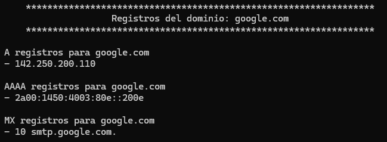
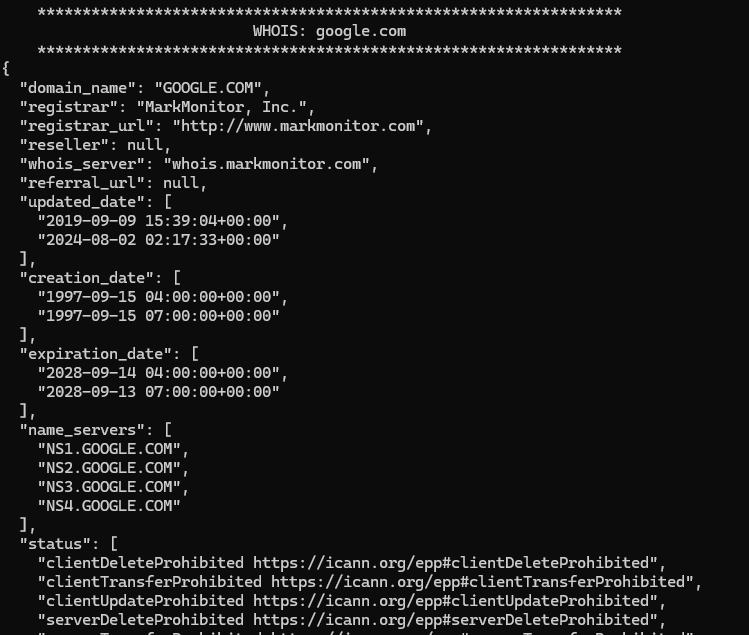

# 🔍 DNS & Whois Enumerator

Herramienta de línea de comandos desarrollada en __Python__ diseñada para la fase de reconocimiento en auditorías de hacking ético. Permite automatizar la recolección de registros DNS y datos de las bases de datos WHOIS de múltiples dominios de forma simultánea.

## 🚀 Características
- __Consultas DNS Flexibles:__ Soporta múltiples tipos de registros (A, AAAA, MX, CNAME, TXT, etc.).
- __Soporte Multidominio:__ Permite consultar una lista de dominios separados por comas en una sola ejecución.
- **Consultas WHOIS:** Extrae información de registro, propietarios y servidores de nombres directamente de las bases de datos WHOIS.
- __Manejo de errores:__ Gestión de excepciones para dominios inexistentes (NXDOMAIN) o registros no encontrados sin detener la ejecución del script.

## 🛠️ Instalación
Requiere Python 3.x y las siguientes librerías:

```python
dnspython python-whois
```

Las cuales se pueden instalar usando el comando:
```python
pip install -r requirements.txt
```

## 📖 Uso

La herramienta es altamente configurable mediante argumentos por terminal.

### Sintaxis básica
```python
python dns_whois_enumeration.py -d "ejemplo.com" [OPCIONES]
```

### Argumentos

| __Parámetro__ | __Descripción__ |
| :---: | :---: |
| `-d` , `--domain` | [OBLIGATORIO] Dominio o lista de dominios separados por comas. |
| `-R`, `--register` | Registros DNS a consultar (A, MX, etc). Si se usa solo, el default es `A`. |
| `--whois` | Activa la consulta a las bases de datos WHOIS. |

## Ejemplos de uso

### 1. Consulta básica de registros 'A' (Predeterminado):
```python
python dns_whois_enumeration.py -d "google.com" -R
```

### 2. Consulta de múltiples registros específicos:
```python
python dns_whois_enumeration.py -d "github.com" -R "A,MX,NS,TXT"
```

### 3. reconocimiento completo (DNS + WHOIS) de varios dominios:
```python
python dns_whois_enumeration.py -d "example.com,test.com" -R "A,CNAME" --whois
```

### 4. solo información WHOIS:
```python
python dns_whois_enumeration.py -d "python.org" --whois
```




## Estructura del Código

El script se divide en tres bloques principales para facilitar su mantenimiento:

- `bbdd_whois()`: Gestiona la conexión y el formato de salida de los datos de registro de dominio.

- `info()`: Implementa la lógica del resolver de DNS, iterando sobre los tipos de registros solicitados.

- `main()`: Orquestador de la lógica y punto de entrada para los argumentos de argparse.

## Descargo de Responsabilidad (Disclaimer)

Esta herramienta ha sido creada exclusivamente con fines __educativos y de auditoría ética__. El uso de este script contra objetivos sin consentimiento previo es ilegal. El autor no se hace responsable del mal uso de esta herramienta.